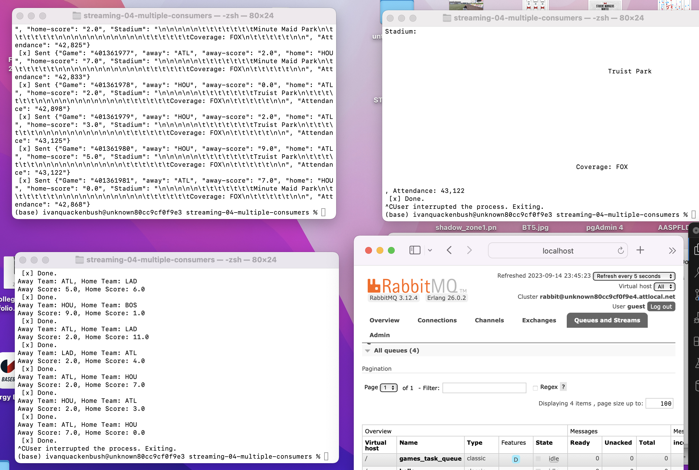

# streaming-04-multiple-consumers
## Author: Ivan Quackenbush Date: September 15, 2023

Prerequisites
Git
Python 3.7+ (3.11+ preferred)
VS Code Editor
VS Code Extension: Python (by Microsoft)
The following modules are required:

Module	Version
csv	1.0
logging	0.5.1.2
webbrowser	3.11.4
sys	3.11.4
time	3.11.4
pika	1.3.2

> Use RabbitMQ to distribute tasks to multiple workers

One process will create task messages. Multiple worker processes will share the work. 

## Before You Begin

1. Fork this starter repo into your GitHub.
1. Clone your repo down to your machine.
1. View / Command Palette - then Python: Select Interpreter
1. Select your conda environment. 

## Read

1. Read the [RabbitMQ Tutorial - Work Queues](https://www.rabbitmq.com/tutorials/tutorial-two-python.html)
1. Read the code and comments in this repo.

## RabbitMQ Admin 

RabbitMQ comes with an admin panel. When you run the task emitter, reply y to open it. 

(Python makes it easy to open a web page - see the code to learn how.)

## Execute the Producer

1. Run emitter_of_tasks.py (say y to monitor RabbitMQ queues)

Explore the RabbitMQ website.

## Execute a Consumer / Worker

1. Run listening_worker.py

Will it terminate on its own? How do you know? 
I know that it terminated on its own because it finished its task

## Ready for Work

1. Use your emitter_of_tasks to produce more task messages.

## Start Another Listening Worker 

1. Use your listening_worker.py script to launch a second worker. 

Follow the tutorial. 
Add multiple tasks (e.g. First message, Second message, etc.)
How are tasks distributed? 
Monitor the windows with at least two workers. 
Which worker gets which tasks?

## Reference

- [RabbitMQ Tutorial - Work Queues](https://www.rabbitmq.com/tutorials/tutorial-two-python.html)

## Screenshot

